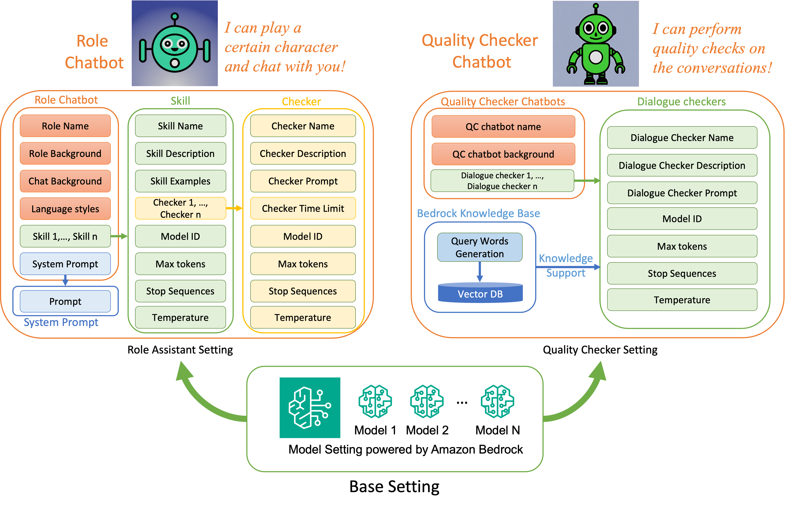
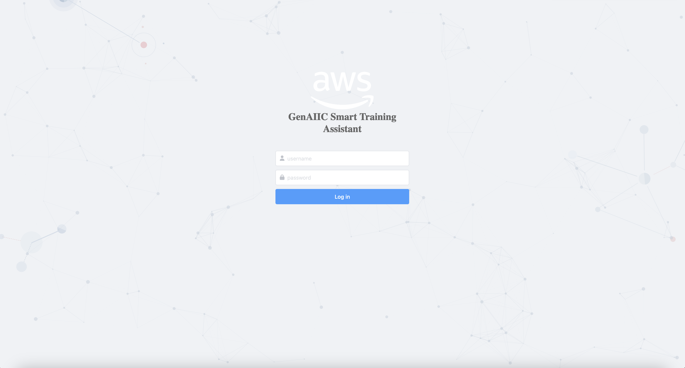
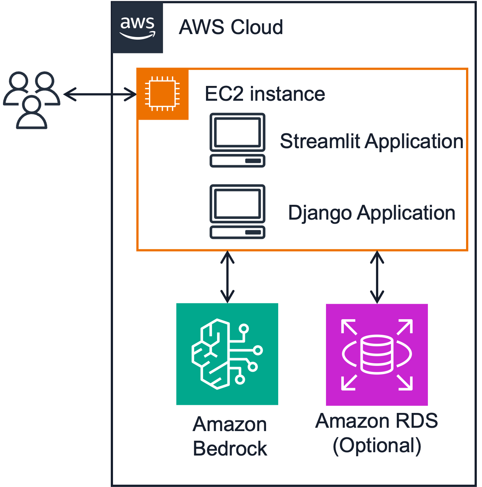

# Smart Training Assistant


[](https://github.com/newpanjing/simpleui)

[中文Readme](./README_zh.md)
[Video](https://aws.highspot.com/items/666812973cc797aaa133c66a?lfrm=shp.4)

- [Smart Training Assistant](#smart-training-assistant)
  - [Brief Introduction](#brief-introduction)
    - [What is Smart Training Assistant](#what-is-smart-training-assistant)
  - [Why Develop an Smart Training Assistant](#why-develop-an-smart-training-assistant)
  - [Advantages of Smart Training Assistant](#advantages-of-smart-training-assistant)
  - [Online Demo (Only for GenAIIC Internal Use, Not Support Now! Please deploy in your instance!)](#online-demo-only-for-genaiic-internal-use-not-support-now-please-deploy-in-your-instance)
  - [Feature Details](#feature-details)
    - [Base Settings](#base-settings)
    - [Role Assistant Settings](#role-assistant-settings)
    - [Dialogue Checker Setting](#dialogue-checker-setting)
  - [Preset Assistant](#preset-assistant)
  - [Install](#install)
  - [Usage](#usage)
  - [Contributor](#contributor)
  - [Common Issues](#common-issues)


## Brief Introduction

**This project is an experimental project for the AWS GenAIIC. The code is intended for research and testing purposes only, and not for production use. Do not use this code for production deployments. If you have any questions or need to use this project in production, please contact Hao Huang (tonyhh@amazon.com).**

### What is Smart Training Assistant
The smart training assistant includes Quality Checker Assistant and Role Assistant, which can assist the customer service department in achieving customized dialogue quality inspection and customized process customer service training.

## Why Develop an Smart Training Assistant
- Generative AI has significant application scenarios in customer service operations;
- Quality inspection and training are core requirements for customer service departments;
- Smart Training Assistant provides a GenAI application template for customer service quality inspection and training, which can be quickly customized through secondary development to meet personalized customer needs.

## Advantages of Smart Training Assistant

- Rapid development, rapid demonstration for clients
- Focus on business, ignore technical implementation
- Good scalability, easy for secondary development
- Comprehensive backend management and permission management




This **Smart Training Assistant** is based on GenAIIC POCs (Customer: Huolala, Mobvista), which contains two key components:

- **Role Assistant (Chatbot)**: The Role Assistant is capable of assuming specific roles with predefined role backgrounds, conversational backgrounds, language styles, and other relevant characteristics.
- **Quality Checker Assistant (Chatbot)**: The Quality Checker Assistant has the capability to evaluate the quality of a dialogue across customized areas or domains.

For system architecture, **Smart Training Assistant** contains:
- Django-based backend:
    - supporting **RESTful APIs**;
    - supporting **Token-based Permission Control**;
    - MySQL database in Amazon RDS;

- Streamlit-based frontend
    - A easy-use streamlit frontend for demo (**Please don't use it in production**).


## Online Demo (Only for GenAIIC Internal Use, Not Support Now! Please deploy in your instance!)
- Demo: http://54.159.114.20:8501/admin/
    - Since the demo is not deployed in production environment, so you may meet inaccessibility. Please contact me (Hao Huang, tonyhh@amazon) via slack if you can not access the online demo.
    - The following account is not super user, if you want to access the User Admin, please contact me (Hao Huang, tonyhh@amazon) via slack.
- Username: GenAIIC-test01
- Password: 20240410genaiic
- API Doc: http://54.159.114.20:8501/redoc/
- API Swagger: http://54.159.114.20:8501/swagger/



## Feature Details

### Base Settings
<details> <summary>detailed introduction</summary>

The Base settings contains base model setting.
- Base model setting: You can add/modify/remove/search base model here. Now, we only support the Claude 3 models.

</details>


### Role Assistant Settings

<details> <summary>detailed introduction</summary>

The **Role Assistant Settings** consists of four parts: Role Chatbot, Skills, Response Checkers, and the System Prompts.

- Roles:
    - The role defines the basic persona and language style of the simulated training assistant.
    - The role includes the role name, role background, language skills, and other relevant characteristics.

- Skills:
    - Skills include the conversation states that Role Assistant can use, such as passive responses, actively proposing questions about a certain area, etc., to facilitate controllable conversation flow.
    - A skill includes the skill name, skill description, skill examples, response checker (optional), and LLM-related configurations.

- Response Checkers:
    - The response quality checker can check whether the assistant's response in a certain round meets the requirements of skill. If not, it will request a new generation until the maximum number is reached.
    - The response quality checker includes the checker name, checker description, checker prompt, maximum number of quality checks, and LLM-related configurations. The checker prompt will be directly inputed to LLM, with the placeholder {msg}.

- System Prompts:
    - System prompts is the system prompt for **Role Assistant Settings**. We already prepared two system prompts (one for Chinese and the other for English). If you have specific requirements, you can add your own core prompts. Remember, please keep the **Placeholder** in core prompts. Please refer to default System Prompt(id1, Chinese) or System Prompt(id2, English).
</details>


### Dialogue Checker Setting

<details> <summary>detailed introduction</summary>

The **Dialogue Checker Setting** consists of quality checking chatbots and dialogue checkers.

- quality checking chatbot:
    - The quality checking chatbot defines the quality checking scenario, including the name, background, and a sequence of **dialogue checkers**.

- Dialogue Checkers:
    - Dialogue checkers are components for specifically checking the quality of conversations, with the output format defaulting to JSON format.
    - A dialogue checker includes the checker name, description, prompt, and LLM-related configurations. The checker prompt will be directly inputed to LLM, with the placeholder {msg}.
    - Please note when you develop you own prompt, the response format needs to be in JSON format (for convenient display in the frontend Streamlit).

</details>

## Preset Assistant

For a more intuitive demonstration of all the features of the intelligent training assistant, the system has preset some assistants for you to choose from.

- **Role Assistants**:
    - Huolala Driver Assistant (Chinese): Simulates a conversation between a Huolala external driver and a recruiter.
    - Jeff Bezos (English): Simulates a conversation between Jeff Bezos and someone interested in Amazon.
- **Quality Inspection Assistants**:
    - Huolala Quality Inspection Assistant (Chinese):
        - Capability Enhancement Analysis: Provides suggestions for capability enhancement to the recruiter.
        - Service Attitude Detection: Detects the service attitude of the recruiter.
    - General Quality Inspection Assistant (English):
        - Profanity Detection: Detects whether the conversation contains profanity.
        - Attitude Detection: Detects whether the conversation attitude is rude.
        - Information Verification (Based on Knowledge Base): Verifies whether the conversation content matches the data in the knowledge base.


## Install




- AWS Prerequisites
    - AWS Services
        - AWS EC2 (t3.medium is enough, 40GB disk is enough, OS: Ubuntu or Amazon Linux)
        - (optional) AWS RDS
    - AWS Permissions
        - AmazonBedrockFullAccess (You should request the Claude 3 access permerssion first)
    - Security Groups
        - Type:Custom Port:8501 Source:0.0.0.0/0
        - Type:Custom Port:8502 Source:0.0.0.0/0

- Install anaconda
```
# miniconda install example
wget https://repo.anaconda.com/miniconda/Miniconda3-latest-Linux-x86_64.sh
sh Miniconda3-latest-Linux-x86_64.sh
```
- One Step Install Python Environments

```bash
sh ./install.sh
```


- Clone Repo
```bash
git clone git@ssh.gitlab.aws.dev:genaiic-reusable-assets/demo-artifacts/smart_training_assistant.git
```

## Usage

- Active Your Conda Environment

```bash
conda activate smart_training_assistant
```

- **Set Iframe Page**
You need to modify the Iframe page address in Django to access the frontend:
    - Modification location: `/smart_training_assistant/backend/backend/settings.py` line 162, please modify it to the public IP address of your machine.

- One Step Running 

```bash
sh ./run.sh
```

- **Config Bedrock Region**
  - the default region is `us-east-1. If you want to modify the region, please change it in backend page: Base Setting -> Base models. You can click the specific model and change its region.


- One Step Stopping 

```bash
sh ./stop.sh
```

## Contributor
- Nancy Wu(Nancynwu@amazon.com)
- Hao Huang (tonyhh@amazon.com)
- Xuefei Zhang (xuefegzh@amazon.com)
- Guang Yang (yaguan@amazon.com)

## Common Issues
- I cannot access my website
    - Please disconnect the VPN and try again.
    - The access address of the website is: http://your_public_IP:8501/admin/
    - Please ensure that the security groups for ports 8501 and 8502 are open.
    - If you still cannot access it, please check the frontend and backend log files to see if there are any errors.
- I can access the website, but the chatbot prompts that I don't have permission to access the model:
    - Please check your Bedrock permissions
    - Please check if you can access this model
    - Please check if your region is consistent with the model region in the backend configuration under Base Setting -> Base models
