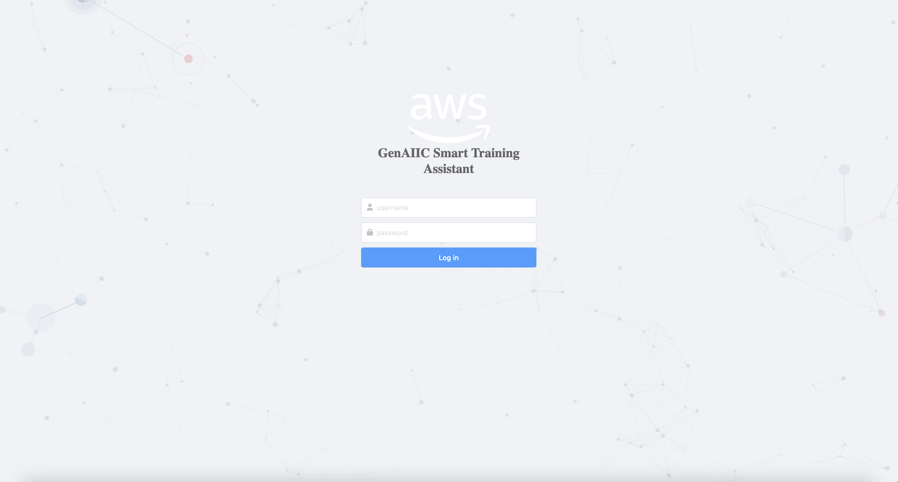

# 智能培训助手

[](https://github.com/newpanjing/simpleui)

[English Readme](./README.md)
[视频](https://aws.highspot.com/items/666812973cc797aaa133c66a?lfrm=shp.4)

- [智能培训助手](#智能培训助手)
  - [简介](#简介)
  - [智能培训助手是什么？](#智能培训助手是什么)
  - [为什么要开发智能培训助手](#为什么要开发智能培训助手)
  - [为什么要使用智能培训助手](#为什么要使用智能培训助手)
  - [在线演示 (仅供GenAIIC内部使用，该IP已不支持，请自行部署，用户名密码不变)](#在线演示-仅供genaiic内部使用该ip已不支持请自行部署用户名密码不变)
  - [功能详情](#功能详情)
    - [基本设置](#基本设置)
    - [角色对话设置](#角色对话设置)
    - [对话检查器设置](#对话检查器设置)
  - [预设助手](#预设助手)
  - [安装](#安装)
  - [使用方法](#使用方法)
  - [贡献者](#贡献者)
  - [常见问题](#常见问题)


## 简介

**本项目是AWS GenAIIC的一个实验性项目。这个代码仅用于研究和测试目的,不适合用于生产环境。请不要将此代码部署到生产环境中。如果您有任何问题或需要在生产环境中使用此项目,请联系 Hao Huang (tonyhh@amazon.com)。**

## 智能培训助手是什么？

智能培训助手包括对话质检和客服培训助手，可以协助客服部门完成自定义维度的对话质检和自定义流程的客服培训。

## 为什么要开发智能培训助手

1）客服业务中，生成式AI有很大应用场景；
2）质检与培训是客服部门核心需求；
3）智能培训助手提供了一个客服质检和培训生成式AI应用模板，可以快速基于此模板进行二次开发，满足客户个性化需求。

## 为什么要使用智能培训助手

- 快速开发，快速给客户演示
- 关注业务，忽略底层技术实现
- 良好的可拓展性，可以方便地进行二次开发
- 完善的后台和权限管理


**智能培训助手**基于GenAIIC POC项目(客户: Huolala, Mobvista),包含两个关键组件:
- **角色助手**: 角色助手能根据预定义角色背景、对话背景、语言风格和其他相关设定进行模拟对话。
- **质检助手**: 质检助手能够根据自定义的领域或主题评估对话质量，判断是否合规。

在架构方面,**智能培训助手**包括:
- 基于Django的后端:
    - 支持 **RESTful API**;
    - 支持 **基于Token的权限控制**;
    - Amazon RDS中的MySQL数据库;

- 基于Streamlit的前端:
    - 一个使用简单的streamlit前端（**请勿用于生产环境**）。

## 在线演示 (仅供GenAIIC内部使用，该IP已不支持，请自行部署，用户名密码不变)
- 演示网站: http://54.159.114.20:8501/admin/
    - 由于演示环境并非生产环境,因此您可能会遇到无法访问的情况。如果无法访问在线演示,请通过 Slack 联系我(Hao Huang,tonyhh@amazon)。
    - 以下账户并非超级用户,如果您需要访问用户管理,请通过 Slack 联系我(Hao Huang,tonyhh@amazon)。
- Username: GenAIIC-test01
- Password: 20240410genaiic
- API Doc: http://54.159.114.20:8501/redoc/
- API Swagger: http://54.159.114.20:8501/swagger/



## 功能详情

### 基本设置
<details> <summary>详细介绍</summary>

基本设置包括基本模型设置和核心提示设置:
- 模型设置: 您可以在这里添加/修改/删除/搜索基本模型。目前,我们只支持Claude 3模型。
</details>


### 角色对话设置

<details> <summary>详细介绍</summary>

**角色助手设置**由四个部分组成:角色聊天机器人、技能、响应检查器和系统提示。

- 角色聊天机器人:
    - 角色定义了模拟训练助手的基本人格和语言风格。
    - 支持多种专业角色类型：医药代表、医生等。
    - 支持多个专业领域：心血管、内分泌、肿瘤、神经等。
    - 可设置专业级别：主任医师、副主任医师、高级医药代表等。
    - 包含详细的角色背景、对话背景和语言风格设置。

- 技能:
    - 技能分类包括医药知识、沟通技巧等不同类型。
    - 医药知识技能：
        - 产品特性介绍
        - 临床应用解析
        - 适应症说明
        - 用药指导
    - 沟通技巧：
        - 专业术语运用
        - 需求挖掘
        - 异议处理
        - 专业建议提供
    - 每个技能都配有详细的示例和质量检查器。

- 响应检查器:
    - 专门的医药对话质量检查：
        - 专业术语使用准确性
        - 产品信息合规性
        - 沟通技巧评估
    - 支持自定义检查维度和标准
    - 包含最大重试次数和LLM相关配置

- 系统提示词:
    - 预设医药场景的系统提示模板
    - 支持中英文双语提示
    - 可自定义专业领域的特定提示

</details>


### 对话检查器设置 

<details> <summary>详细介绍</summary>

**对话检查器设置**由质量检查聊天机器人和对话检查器组成。

- 质量检查聊天机器人:
    - 质量检查聊天机器人定义了质量检查场景,包括名称、背景和一系列对话检查器。
- 对话检查器:
    - 对话检查器是专门用于检查对话质量的组件,输出格式默认为JSON格式。
    - 对话检查器包括检查器名称、描述、提示和LLM相关配置。检查器提示将直接输入到LLM,其中包含占位符{msg}。
    - 请注意,当您开发自己的提示词时,响应格式需要为JSON格式(便于在前端Streamlit中显示)。

</details>

## 预设助手

为了更直观的演示智能培训助手的所有功能，系统预设了一些助手供您选择。

- **角色助手**: 
    - 货拉拉司机助手（中文）：模拟一位货拉拉外部司机与邀约员对话。
    - 杰夫贝佐斯（英文）：模拟杰夫贝佐斯与对亚马逊感兴趣的人进行对话。
    - 医药对话助手（中文）：
        - 专业医药代表：模拟不同专业领域（心血管、内分泌、肿瘤、神经等）的医药代表进行产品介绍和专业交流。
        - 专科医生：模拟不同级别（主任医师、副主任医师等）和专业领域的医生进行诊疗讨论。
        
- **质检助手**: 
    - 货拉拉质检助手（中文）：
        - 能力提升分析：对邀约员给出能力提升建议
        - 服务态度检测：检测邀约员的服务态度
    - 通用质检助手（英文）：
        - 脏话检测：检测对话是否含有脏话
        - 态度检测：检测对话态度是否粗鲁
        - 信息校验（基于知识库）：检测对话内容是否与知识库数据相符合
    - 医药对话质检助手（中文）：
        - 专业性检查：评估医药对话中的专业术语使用是否准确
        - 合规性检查：确保对话符合医药推广法规要求
        - 产品信息准确度：验证产品信息介绍的准确性
        - 沟通技巧评估：分析医药代表的沟通策略和效果
        - 专业知识掌握：评估医药代表对产品和疾病知识的掌握程度

## 安装


- AWS 预先条件
    - AWS Services
        - AWS EC2 (t3.medium is enough, 40GB disk is enough, OS: Ubuntu or Amazon Linux)
        - (optional) AWS RDS
    - AWS Permissions
        - AmazonBedrockFullAccess  (你需要先申请Claude 3的权限)
    - Security Groups
        - Type:Custom Port:8501 Source:0.0.0.0/0
        - Type:Custom Port:8502 Source:0.0.0.0/0

- 安装anaconda
```
# miniconda安装示例
wget https://repo.anaconda.com/miniconda/Miniconda3-latest-Linux-x86_64.sh
sh Miniconda3-latest-Linux-x86_64.sh
```

- 下载Repo
```bash
git clone git@ssh.gitlab.aws.dev:genaiic-reusable-assets/demo-artifacts/smart_training_assistant.git
```

- 一键安装python环境
```bash
sh ./install.sh
```


## 使用方法

- 激活Conda环境

```bash
conda activate smart_training_assistant
```

- **设置Iframe页面**
你需要修改Django中Iframe的页面地址来访问前端：
    - 修改位置：`/smart_training_assistant/backend/backend/settings.py` 162行，请修改为你机器的公网IP地址。

- 一键运行

```bash
sh ./run.sh
```
http://54.202.131.124:8501/admin
http://54.202.131.124:8502/


针对医疗行业的修改：
# 1. 确保在项目根目录下
cd /home/ec2-user/AI-Assistant

# 2. 给脚本添加执行权限
chmod +x setup_medical_roles.sh

# 3. 运行脚本
./setup_medical_roles.sh

- **配置Bedrock区域**
  - 默认区域为us-east-1，如果您需要修改bedrock调用区域，请进入配置页面Base Setting -> Base models，选择对应模型进行修改。

- 一键停止

```bash
sh ./stop.sh
```

http://54.202.131.124:8501/admin/

http://54.202.131.124:8502

## 贡献者
- Hao Huang (tonyhh@amazon.com)
- Xuefei Zhang (xuefegzh@amazon.com)
- Guang Yang (yaguan@amazon.com)

## 常见问题

- 我无法访问我的网站
  - 请断开VPN使用；
  - 网站的访问地址是：http://你的公网IP:8501/admin/
  - 请注意你的8501，8502两个端口的安全组已经开放
  - 如果还不能访问，请检查前后端log文件，查看是否存在错误。

- 我可以访问网站，但是聊天机器人提示没有权限访问模型：
  - 请检查你的Bedrock权限
  - 请检查你是否可以访问这个模型
  - 请检查你的区域是否与后端配置中 Base Setting -> Base models中对应模型区域一致

# 检查端口
netstat -tulpn | grep 850

# 检查日志
tail -f frontend.log

# 尝试访问服务
curl http://localhost:8502